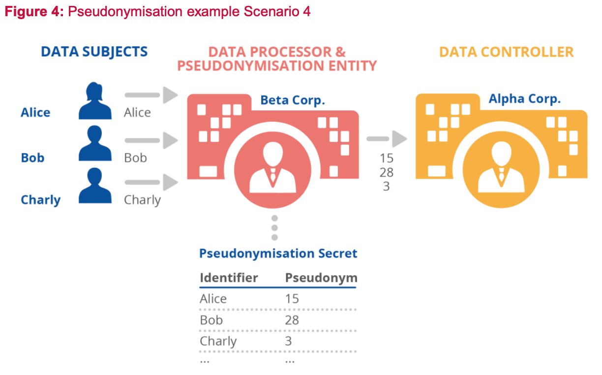

# Pseudonymisation-as-a-Service
## Pseudonymisation advisory services for state of the art techniques and best practiceson, and shaping technology according to data protection and privacy requirements. 

### Risk-based approach to pseudonymisation
Pseudonymisation techniques have their own well understood and intrinsic properties but this does not mean the selection and implementation of an appropriate pseudonymisation technique is a simple and trivial task. We provide a risk-based approach to assess the required protection level and consider relevant utility and scalability.

**Data controllers and processors need to carefully consider the implementation of pseudonymisation following a risk-based approach, taking into account the purpose and overall context of the personal data processing, as well as the utility and scalability levels they wish to achieve.**

**Producers of products, services and applications should provide adequate information to controllers and processors regarding their use of pseudonymisation techniques and the security and data protection levels that these provide.**

**Advanced Analytica can provide practical guidance to data controllers and processors with regard to the assessment of the risk, while advising on best practice in the field of pseudonymisation.**

# 1. INTRODUCTION

## 1.1 BACKGROUND
Pseudonymisation is a well-known de-identification process that has gained additional attention following the adoption of EU and UK GDPR, where it is referenced as both a technical security measure and data protection by design mechanism. **In addition, in the GDPR context, pseudonymisation can motivate the relaxation, to a certain degree, of data controllers’ legal obligations if properly applied.**

## 1.2 SCOPE AND OBJECTIVES

The overall scope of our pseudonymisation (tech-legal) service is to provide our clients with guidance and advise for best practice on the technical implementation of data pseudonymisation strategy.

More specifically, our objectives are to: 
  - Identify different pseudonymisation scenarios and the relevant actors involved. 
  - Select possible pseudonymisation techniques in correlation with relevant adversarial and attack models. 
  - Analyse the application of pseudonymisation to specific identifiers and other types of structured and unstructured data sets (use cases). 
  - Draw relevant conclusions and make recommendations for ongoing improvement. 
  
It should be noted that most uses cases are generally based on specific types of identifiers (IP addresses, email addresses, and username identifiers in both structured and unstructured data sets) that represent real-life scenarios. At the same time, use cases also reflect diverse requirements with regard to pseudonymisation, i.e. arising from the strict format of IP addresses to the more flexible structure of email addresses and usernames, and the unpredictable nature of large datasets. Our target audience are data controllers, data processors and producers of products, services and applications, and any other interested party in data pseudonymisation.

## 1.3 SERVICE MODULES

The outline of the service is as follows:
  - Implementing a glossary of terms and relevant explanatory notes.
  - Identifying scenarios where pseudonymisation needs to be engaged.
  - Assessing adversarial and attack models with regard the scenarios.
  - Selecting appropriate pseudonymisation techniques and policies.
  - Testing pseudonymisation techniques on identifiers and complex datasets (use cases). 
  - Implementing deploying a pseudonymisation management server and models.
  - Providing ongoing support and recommendations for relevant stakeholders.

Our Pseudonymisation service focuses on analysing technical solutions for the implementation of robust GDPR compliance programmes, privacy by design and security of personal data processing.

# 2. GLOSSARY AND DEFINITIONS 
We present a number of terms that we use as part of our service and are essential to project stakeholder. Some of these terms are based on GDPR, whereas others refer to technical standards or are explicitly defined for the purpose of service delivery.

**Personal Data** refers to any information relating to an identified or identifiable natural person (data subject); an identifiable natural person is one who can be identified, directly or indirectly, in particular by reference to an identifier such as a name, an identification number, location data, an online identifier or to one or more factors specific to the physical, physiological, genetic, mental, economic, cultural or social identity of that natural person (GDPR, art. 4(1)).

**Data Controller** or **Controller** is the natural or legal person, public authority, agency or other body which, alone or jointly with others, determines the purposes and means of the processing of personal data (GDPR, art. 4(7)).

**Data Processor** or **Processor** is the natural or legal person, public authority, agency or other body which processes personal data on behalf of the controller (GDPR, art. 4(8)).

**Pseudonymisation** is the processing of personal data in such a manner that the personal data can no longer be attributed to a specific data subject without the use of additional information, provided that such additional information is kept separately and is subject to technical and organisational measures to ensure that the personal data are not attributed to an identified or identifiable natural person (GDPR, art. 4(5)).

**Anonymisation** is a process by which personal data is irreversibly altered in such a way that a data subject can no longer be identified directly or indirectly, either by the data controller alone or in collaboration with any other party (ISO/TS 25237:2017).

**Identifier** is a value that identifies an element within an identification scheme. A unique identifier is only one element associated with personal data.

**Pseudonym**, also known as cryptonym or just nym, is a piece of information associated to an identifier of an individual or any other kind of personal data (e.g. location data). Pseudonyms may have different degrees of linkability (to the original identifiers). The degree of linkability of different pseudonym types is important to consider for evaluating the strength of pseudonyms but also for the design of pseudonymous systems where a certain degree of linkability may be desired (e.g. when analysing pseudonymous log files or for reputation systems).

**Pseudonymisation Function** , denoted *𝑃*, is a function that substitutes an Identifier *𝐼𝑑* by a Pseudonym *𝑝𝑠𝑒𝑢𝑑𝑜*. 

**Pseudonymisation secret**, denoted *𝑠* is an (optional) parameter of a pseudonymisation function *𝑃*. The function *𝑃* cannot be evaluated/computed if *𝑠* is unknown. Recovery function, denoted *𝑅*, is a function that substitutes a Pseudonym *𝑝𝑠𝑒𝑢𝑑𝑜* by the Identifier *𝐼𝑑* using the pseudonymisation secret *𝑠*. It inverts the pseudonymisation function *𝑃*. 

**Pseudonymisation Mapping Table** is a representation of the action of the pseudonymisation function. It associates each identifier to its corresponding pseudonym. Depending on the pseudonymisation function *𝑃*, the pseudonymisation mapping table may be the pseudonymisation secret or part of it. 

**Pseudonymisation Entity** is the entity responsible of processing identifiers into pseudonyms using the pseudonymisation function. It can be a data controller, a data processor (performing pseudonymisation on behalf of a controller), a trusted third party (performing pseudonymisation on behalf of a controller as a service)o r a data subject, depending on the pseudonymisation Scenario. It should be stressed that, following this definition, the role of the pseudonymisation entity is strictly relevant to the practical implementation of pseudonymisation under a specific Scenario. The responsibility for the whole pseudonymisation process (and for the whole data processing operation in general) almost always rests with the controller. 

**Identifier Domain / Pseudonym Domain** refer to the domains from which the identifier and the Pseudonym are drawn. They can be different or the same domains. They can be finite or infinite domains. 

**Adversary** is an entity that tries to break pseudonymisation and link a pseudonym (or a pseudonymised dataset) back to the pseudonym holder(s). Re-identification attack is an attack to  performed by an adversary that aims to re-identify the holder of a Pseudonym.

**Re-identification Attack** is an attack to pseudonymisation performed by an Adversary that aims to re-identify the holder of a pseudonym.

# 3. PSEUDONYMISATION SCENARIOS
Pseudonymisation plays an important role in GDPR as a security measure (art. 32 GDPR), as well as in the context of data protection by design (art. 25 GDPR). The most obvious benefit of pseudonymisation is to hide the identity of the data subjects from any third party (i.e. other than the pseudonymisation entity) in the context of a specific data processing operation. Still, pseudonymisation can go beyond hiding real identities into supporting the data protection goal of unlinkability, i.e. reducing the risk that privacy-relevant data can be linked across different data processing domains. 

Furthermore, pseudonymisation (being itself a data minimisation technique) can contribute towards the principle of data minimisation under GDPR, for example in cases where the controller does not need to have access to the real identities of data subjects but only to their pseudonyms. Finally, another important benefit of pseudonymisation that should be carefully considered is that of data accuracy.

## 3.1 scenario 1: PSEUDONYMISATION FOR INTERNAL USE
A common data pseudonymisation scenario is when data are collected directly from the data subjects and pseudonymised by the data controller, for subsequent internal processing.

In this Scenario, the data controller (Alpha Corp.) has the role of the pseudonymisation entity, as it performs the selection and assignment of pseudonyms to identifiers. It must be pointed out that the data subjects do not necessarily know nor learn their particular pseudonym, as the pseudonymisation secret (e.g. the pseudonymisation mapping table in this example), is known only to Alpha Corp. The role of pseudonymisation in this case is to enhance the security of personal data either for internal use (e.g. sharing between different units of the controller)11 or in the case of a
security incident.

## 3.2 scenario 2: PROCESSOR INVOLVED IN PSEUDONYMISATION

This scenario is a variation of scenario 1, where a data processor is also involved in the process by obtaining the identifiers from the data subjects (on behalf of the controller). However, the pseudonymisation is still performed by the controller.

In this Scenario, a dedicated data processor (Beta Inc.) is given the task to collect the identifiers from the data subjects and forward this information to a subsequent data controller (Alpha Corp.), which finally performs the pseudonymisation. The controller is again the pseudonymisation entity. An example for such a scenario might be a cloud service provider that hosts data collection services on behalf of the data controller. Then, the controller still is in charge of
applying data pseudonymisation prior to any subsequent processing. The goals for pseudonymisation are the same as in scenario 1 (but this time a processor is also involved in
the process).

## 3.3 scenario 3: SENDING PSEUDONYMISED DATA TO A PROCESSOR

Contrary to the previous Scenario, in this scenario the data controller again performs the pseudonymisation but this time the processor is not involved in the process but only receives the pseudonymised data from the controller.

In this scenario a data controller (Alpha Corp.) collecting data and performing the task of data pseudonymisation (in its role as pseudonymisation entity). The difference with previous Scenarios is that now this data controller forwards the pseudonymised data to a subsequent data processor (Beta Inc.), e.g. for statistical analysis, or persistent data storage. In this Scenario, the protection goal provided by data pseudonymisation can unfold: Beta Inc. does not learn the identifiers of the data subjects, thus is not directly able to re-identify the natural persons behind the data (assuming that no other attribute that could lead to re-identification is available to Beta Inc.). In this way, pseudonymisation protects the security of the data with regard to the processor.

A variation of this scenario could be the case where the pseudonymised data is not sent to a data processor but to another data controller (e.g. in the context of a legal obligation of the original controller or another legal basis).

## 3.4 scenario 4: PROCESSOR AS PSEUDONYMISATION ENTITY

Another possible scenario is the case where the task of pseudonymisation is assigned by the controller to a data processor (e.g. a cloud service provider that manages the pseudonymisation secret and/or arranges the relevant technical facilities).

This shows a case where the personal data are sent by the data subjects to a data processor (Beta Inc), which subsequently performs the pseudonymisation, thus acting as the pseudonymisation entity on behalf of the controller (Alpha Corp). The pseudonymised data is then forwarded to the data controller. In this particular Scenario, only the pseudonymised data are stored on the controller’s side. In this way, security at controller’s level is enhanced through data de-identification (e.g. in case of data breach at controller’s side).Still, in all cases the controller is able to re-identify the data subjects through the data processor. Moreover, security at processor’s side becomes of great importance. 

A variation of this scenario could be a case where several different processors are involved in the pseudonymisation process as a sequence of pseudonymisation entities (chain of processors).

## 3.5 scenario 5: THIRD PARTY AS PSEUDONYMISATION ENTITY

In this scenario the pseudonymisation is performed by a third party (not a processor) who subsequently forwards the data to the controller. Contrary to the scenario 4, the controller in this scenario does not have access to the data subjects’ identifiers (as the third party is not under the control of the data controller). 

This shows a case where the personal data are sent to a third party (Gamma SE), which subsequently performs the pseudonymisation, thus acting as the pseudonymisation entity. The pseudonymised data is then forwarded to the data controller (Alpha Corp). In this Scenario, the data controller cannot directly or indirectly link individual data records to data subjects itself. In this way, security and data protection at controller’s level are enhanced in accordance with the principle of data minimisation. Such scenario can be applicable in cases where the controller does not need to have access to the identities of the data subjects (but only to the pseudonyms).

This scenario could be very relevant to cases of joint controllership, where one of the controllers is performing the pseudonymisation (acting as the trusted third party - TTP in figure 5), and the other one only receives the pseudonymised data for further processing. 

An interesting variation of this scenario (that would require further analysis) could be the case where the TTP is distributed over more than one entities, which can only jointly create and revert pseudonyms (or possibly based on a secret sharing scheme), so that one does not have to put trust only into a single entity.

## 3.6 scenario 6: DATA SUBJECT AS PSEUDONYMISATION ENTITY

This is a special case of pseudonymisation where the pseudonyms are created by the data subjects themselves as part of the overall pseudonymisation process.

As can be seen in the example of Figure 6, every individual generates his/her pseudonym, then forwards their data with this pseudonym onwards.

An example of such type of data pseudonymisation systems would be the use of the public key of a key pair in blockchain systems (e.g. Bitcoin) to produce the pseudonym. The goal of pseudonymisation in such case is that the controller does not learn the identifiers of the data subjects and the data subjects can be in control of the pseudonymisation process; of course, the responsibility of the overall pseudonymisation scheme still rests with the data controller. Again this is in line with the principle of data minimisation and can be applied in cases where the controller does not need to have access to the original identifiers (i.e. the pseudonyms are sufficient for the specific data processing operation).

# 4. ADVERSARY MODEL

The primary goal of pseudonymisation is to limit the linkability between a pseudonymised dataset and the holders of the pseudonyms and to thereby protect the identity of the data subjects. This type of protection is typically intended to counter the efforts of an adversary to perform a re-identification attack. 

In this section we consider the possible adversarial models and different types of re-identification attacks that are important to pseudonymisation. To this end, the notions of insider and external adversaries are addressed, while examining their possible roles under the pseudonymisation Scenarios discussed earlier in the report. 

Understanding these topics is an essential element for further analysing the use of pseudonymisation techniques in the following sections.

## 4.1 INSIDER ADVERSARIES

According to the common understanding of the term in IT security, an insider is an adversary
with specific knowledge, capabilities, or permissions (with regard to the target of the
adversary). In the context of pseudonymisation, this implies that the adversary is in a position to gain information about the pseudonymisation secret and/or other relevant significant information.
For example, considering the Scenarios in Section 3, an insider could be on the controller’s side (e.g. an employee working for the controller) under Scenarios 1, 2, 3 and 4. It could also rest on the processor’s side (e.g. a malicious employee of a contractor) under Scenarios 2 and 4. Last, in the case of scenario 5, the insider adversary could lie within the trusted third party (acting in this scenario as the pseudonymisation entity). By default third parties that might legitimately have access to the personal data (e.g. a supervisory or law enforcement authority) are not considered as adversaries.

## 4.2 EXTERNAL ADVERSARIES
In contrast to the insider adversary, an external adversary does not have direct access to the pseudonymisation secret or other relevant information. However, this type of adversary may have access to a pseudonymised dataset, and may also be able to perform the task of
pseudonymisation to arbitrary input data values chosen by the adversary (e.g. by having access to a black box implementation of the pseudonymisation function, or by being able to force the
pseudonymisation entity to pseudonymise arbitrary inputs). The goal of an external adversary is to increase his or her own information on the pseudonymised dataset, e.g. by learning the identity behind a given pseudonym (and acquiring further information on that identity from the additional data found in the dataset for the given pseudonym).

Considering the Scenarios of Section 3, by definition any actor who acts maliciously in all Scenarios and is not part of the pseudonymisation entity or working on behalf of the pseudonymisation entity should be considered as an external adversary.  A (malicious) data could take the role of an external adversary under scenario 5 or 6. A (malicious) data processor could also take this role under scenario 3.

## 4.3 GOALS OF ATTACK ON PSEUDONYMISATION 
Depending on the context and the pseudonymisation method, the adversary can have different goals that he or she wants to achieve against pseudonymised data, i.e. retrieval of the pseudonymisation secret, complete re-identification, or discrimination. While most of the examples described in the next paragraphs focus on uncovering the “real” identity of the data subjects, it should be noted that a successful attack is not (only) a matter of reverse engineering, but more the capability of singling out a specific individual from a group (even if the “real” identity is not revealed).

### 4.3.1 Pseudonymisation secret 
In this case, the adversary focuses on discovering the pseudonymisation secret (i.e. when the pseudonymisation secret is used). This attack is the most severe one, as with the use of the pseudonymisation secret, the adversary is able to re-identify any pseudonym in the dataset (complete re-identification or discrimination), as well as to perform further pseudonymisation processes on the dataset

### 4.3.2 Complete re-identification
When the aim of the attack is complete re-identification, the adversary wishes to achieve the linking of one or more pseudonyms back to the identity of the pseudonym holders. This type of adversary has largely been discussed in the literature. 

The most severe complete re-identification attack consists of the re-identification of all pseudonyms. The adversary can use two strategies to achieve this goal: recovering each identifier from the corresponding pseudonym independently; or recovering the pseudonymisation secret (see in 4.3.1). The least severe form of complete re-identification attacks involves an adversary who can only re-identify a subset of pseudonyms in the dataset. For example, consider a pseudonymised dataset of student grades of a university course. Each entry of the dataset contains a pseudonym corresponding to the identity of the student (name and surname) and a second pseudonym on the student's gender (e.g. by mapping male students to odd numbers and female students to even numbers). An adversary succeeds in a complete re-identification attack if he/she recovers the name, surname and gender of a student. 

### 4.3.3 Discrimination 
The goal of the discrimination attack is to identify properties of a pseudonym holder (at least one). These properties may not directly lead to uncovering the identity of the pseudonym holder, but may suffice to discriminate him or her in some way. 

Considering the student grades example that was presented before, the dataset of student grades may contain two even numbers among many odd numbers as pseudonyms. Even numbers correspond to female students while odd numbers correspond to male students (this fact is known to the attacker). Both even numbers have scored 100% as result at the final exam. 

Further, let us assume that there are no other students that scored 100% in the pseudonymised dataset. If an adversary gains additional knowledge that a certain student scored 100% in this course, the attacker immediately learns that this student was female. Vice versa, if the adversary learns that a student of that course was female, the adversary immediately learns that this student had scored 100%. It is important to understand that the adversary does not learn the identity of a pseudonym holder here, but only learns some property (i.e. gender or grade value) of the holder. Given that several students share the same combination of property values, the adversary is not able to pinpoint the exact data record of a particular pseudonym holder. However, this extra information gained may already suffice for purposes of discrimination that the adversary intends to perform, or it may be utilised in a subsequent background knowledge attack to uncover the identity behind a pseudonym.

### 4.4 MAIN ATTACKING TECHNIQUES

There are three main generic techniques to break a pseudonymisation function: brute force attacks (exhaustive search), dictionary search, and guesswork. The effectiveness of these attacks depends on several parameters, including:

- The amount of pseudonym holder (data subject) information contained in the pseudonym.
- The background knowledge of the adversary.
- The size of the identifier domain.
- The size of the pseudonym domain.
- The choice and configuration of the pseudonymisation function utilised (this also includes the size of the pseudonymisation secret).

These attacking techniques are briefly described next.

#### 4.4.1 Brute force attack

The practicality of this attack technique is conditioned on the adversary’s ability to compute the pseudonymisation function (i.e. there is no pseudonymisation secret) or his/her access to a “black box” implementation of the pseudonymisation function. Depending on the goal of the attack, extra conditions may apply. If the brute force attack is used to achieve complete reidentification (i.e. restoration of the original identity), the identifier domain must be finite and relatively small. For each pseudonym encountered by the adversary, he/she can attempt to recover the original identifier by applying the pseudonymisation function on each value of the identifier domain until he/she finds a match.

Let us consider the pseudonymisation of a month of birth in a dataset. The size of the identifier domain is 12, thus an adversary can enumerate quickly all the possibilities. The pseudonyms associated to each month are computed in this case as the sum of the ASCII code of the first three letters of the month of birth (with the first being a capital one). Let us consider that an adversary has encountered the pseudonym 301. He or she can apply on each month of birth the pseudonymisation function until he/she finds the month which corresponds to the value 301. Table 1 shows the computations made by the adversary to re-identify pseudonym 301 resulting in the mapping table of the pseudonymisation function.

Obviously, the size of the identifiers domain is critical to successfully mount this attack. For small identifiers domains, like in the example presented above, a brute force attack is trivially feasible. If the identifiers-domain size is infinite, the brute force attack typically becomes infeasible. If the size of the identifiers domain is too large, complete re-identification is extremely difficult, leaving the adversaries with the potential of a discrimination attack. 

Indeed, in such case the adversary can consider a subdomain of the identifiers domain for which he or she can compute all the pseudonyms. Let us come back to the example of Table 1, while assuming that the domain is small. Let us assume that the adversary wants to discriminate people with a month of birth starting with the letter J from those starting with a different letter. This subdomain contains January, June and July. The adversary can mount an exhaustive search on this subdomain by computing the pseudonyms corresponding to January, June and July. If he or she finds a pseudonym different from 281, 301 and 299 then he or she knows that the month of birth is not starting with the letter J. 

In the case where a pseudonymisation secret is used, even a small identifier domain may not allow mounting such an attack (since the attacker is not able to compute the pseudonymisation function and provided that there is no access to a “black box” implementation of this function). In such a case, a brute force attack can be mounted over the entire space of pseudonymisation secrets – namely the attacker exhaustively checks all the possible secrets and, for each of them, he or she computes the recovery function. This attack will be successful if the attacker correctly guesses the pseudonymisation secret, regardless of the size of the identifier domain. Therefore, to thwart such an attack, the number of possible pseudonymisation secrets should be sufficiently large so as to render the attack practically impossible.

#### 4.4.2 Dictionary search

Dictionary search is an optimisation of brute force attack, which can save computation costs. The adversary has to deal with a large amount of pseudonyms to carry out complete reidentification or discrimination. Therefore, he or she precomputes a (huge) set of pseudonyms and saves the result in a dictionary. Each entry in the dictionary contains a pseudonym and the corresponding identifier or information. Each time the adversary needs to re-identify a pseudonym, he/she is going to search into the dictionary. This search has a pre-computation cost of an exhaustive search and stores the result in large memory. The re-identification of a pseudonym has only the cost of a lookup in the dictionary. The dictionary search is essentially the computation and storage of the mapping table. Time/memory trade-offs are even possible using Hellman tables or rainbow tables to further extend the range. However, there are specific variants of this attack that utilise additional knowledge on the way the pseudonymisation function works. Such attacks may even work for infinite input domains.

#### 4.4.3 Guesswork

This type of attack utilises some background knowledge (such as probability distribution or any other side information), which the adversary may have on some (or all) of the pseudonym holders, the pseudonymisation function, or the dataset. Implicitly, exhaustive search and dictionary search assume that all the identifiers have the same probability or frequency of occurrences. However, some identifiers may be more frequent than others. Exploiting the statistical characteristics of the identifiers is known as guesswork and is widely applied in the password-cracking community. It is important to notice that guesswork can still be applied even when the identifiers domain is huge. The adversary does not necessarily need to have access to the pseudonymisation function (since discrimination is possible by simply performing a frequency analysis of the observed pseudonyms). 

Let us consider a case dealing with pseudonyms corresponding to ‘first names’.  The domain of ‘first names’ is difficult to explore in its entirety. However, the adversary knows which ‘first names’ are the most popular (Table 2). The adversary can mount an exhaustive search or
dictionary search on the domain of the most popular ‘first names’ and achieve discrimination.

Let us assume a similar case but with an infinite size of identifiers domain. A finite subdomain of identifiers, which are included in the dataset, can be defined. If the adversary can guess this subdomain, he/she can mount an exhaustive search (see Section 6 for relevant use case on email address pseudonymisation). Depending on the amount of background information or metadata that the adversary possesses, and the amount of linkable information found in the pseudonymised dataset, this type of attack may lead to uncovering the identity of a single pseudonym holder, a fraction of them, or the entirety of the dataset. Especially for small datasets, such attacks may be feasible with high success rates.

### 4.5 UTILITY AND DATA PROTECTION

Depending on the choice of pseudonymisation function, a pseudonym may contain some information on the original identifier. Therefore, every such type of pseudonym carries the risk of being subject to a re-identification attack as those described above. For example, an attacker with sufficient background knowledge might be able to link the pseudonym back to its identifier by performing a guesswork.

However, in many cases, the additional information on the original identifier contained in the pseudonym is kept for linkage among pseudonyms themselves, to be performed by a valid subsequent data controller. For instance, a pseudonym may keep the year of birth from a person's birth date as part of the pseudonym (e.g. ‘’AAAA1999’’). This way, it is feasible to categorise pseudonyms based on their year of birth, e.g. concerning their age, their legal status (child or adult), their life conditions (schoolchild/working/retired), or similar. This may be an intentional feature of the pseudonymisation function utilised, allowing controllers to perform such sort of classification even on the pseudonymised data. 

Clearly, the choice of the pseudonymisation function may allow for some utility of the pseudonyms created, taking into account the potential loss of protection caused by this pseudonymisation approach. Hence, a trade-off between utility and data protection can be considered (see Figure 7). When considering the application of pseudonymisation to real-world Scenarios, this trade-off should be analysed carefully, so as to optimize utility for the intended purposes while keeping the protection of the pseudonym holders (data subjects) as strong as possible.

# 5. PSEUDONYMISATION TECHNIQUES

Following the adversary models and types of attacks described in Section 4, this Section presents in brief the most common pseudonymisation techniques and policies today. 

In principle, a pseudonymisation function maps identifiers to pseudonyms. There is one fundamental requirement for a pseudonymisation function. Let us consider two different identifiers *𝐼𝑑1* and *𝐼𝑑2* and their corresponding pseudonyms *𝑝𝑠𝑒𝑢𝑑𝑜1* and *𝑝𝑠𝑒𝑢𝑑𝑜2*. A pseudonymisation function must verify that *𝑝𝑠𝑒𝑢𝑑𝑜1* is different than *𝑝𝑠𝑒𝑢𝑑𝑜2*. Otherwise, the recovery of the identifier could be ambiguous: the pseudonymisation entity cannot determine if *𝑝𝑠𝑒𝑢𝑑𝑜1* corresponds to *𝐼𝑑1* or *𝐼𝑑2*. However, a single identifier 𝐼𝑑 can be associated to multiple pseudonyms (*𝑝𝑠𝑒𝑢𝑑𝑜1, 𝑝𝑠𝑒𝑢𝑑𝑜2…*) as long as it is possible for the pseudonymisation entity to invert this operation. In all cases, according to the definition of pseudonymisation (see section 2), there exists some additional information that allows the association of the pseudonyms with the original identifiers; this is the pseudonymisation secret. The simplest case of pseudonymisation secret is the pseudonymisation mapping table.

In the following sections, the main options available to pseudonymise a single identifier are first defined. The different policies available for pseudonymisation are then described, comparing their implementation characteristics. A reference to the main criteria that a controller may use to select a pseudonymisation technique is also made. Last, the possibilities of recovery of pseudonymisation by the pseudonymisation entity are discussed.

##  5.1 SINGLE IDENTIFER PSEUDONYMISATION 
Starting from the pseudonymisation of a single identifier, a list of possible approaches is presented below, together with relevant advantages and constraints.

### 5.1.1 Counter

Counter is the simplest pseudonymisation function. The identifiers are substituted by a number chosen by a monotonic counter. First, a seed *𝑠* is set to 0 (for instance) and then it is incremented. It is critical that the values produced by the counter never repeat to prevent any ambiguity. 

The advantages of the counter rest with its simplicity, which make it a good candidate for small and not complex datasets. In terms of data protection, the counter provides for pseudonyms with no connection to the initial identifiers (although the sequential character of the counter can still provide information on the order of the data within a dataset). This solution, however, may have implementation and scalability issues in cases of large and more sophisticated datasets, as the complete pseudonymisation mapping table needs to be stored.

### 5.1.2 Random number generator (RNG)

RNG is a mechanism that produces values in a set that have an equal probability of being selected from the total population of possibilities and, hence, are unpredictable1 . This approach is similar to the counter with the difference that a random number is assigned to the identifier.

Two options are available to create this mapping: a true random number generator or a cryptographic pseudo-random generator (see [11] for exact definitions). It should be noted that in both cases, without due care, collisions can occur. A collision is the case of two identifiers being associated to the same pseudonym. The probability that a collision will appear is related to the well-known birthday paradox. 

RNG provides strong data protection (as, contrary to the counter, a random number is used to create each pseudonym, thus it is difficult to extract information regarding the initial identifier, unless the mapping table is compromised). Collisions may be an issue as mentioned earlier, as well as scalability (the complete pseudonymisation mapping table must be stored), depending on the implementation Scenario.

### 5.1.3 Cryptographic hash function

A cryptographic hash function takes input strings of arbitrary length and maps them to fixed length outputs. It satisfies the following properties:

- One-way: it is computationally infeasible to find any input that maps to any pre-specified output. 
- Collision free: it is computationally infeasible to find any two distinct inputs that map to the same output. 

A cryptographic hash function is directly applied to the identifier to obtain the corresponding pseudonym: *𝑃𝑠𝑒𝑢𝑑𝑜 = 𝐻(𝐼𝑑)*. The domain of the pseudonym depends on the length of the digest produced by the function. 

While a hash function can significantly contribute towards data integrity, it is generally considered weak as a pseudonymisation technique as it is prone to brute force and dictionary attacks. Specific examples of this weakness are provided in Sections 6 and 7 below.

### 5.1.4 Message authentication code (MAC)

This primitive can be seen as a keyed-hash function. It is very similar to the previous solution except that a secret key is introduced to generate the pseudonym. Without the knowledge of this key, it is not possible to map the identifiers and the pseudonyms. HMAC is by far the most popular design of message authentication code used in Internet protocols. 

MAC is generally considered as a robust pseudonymisation technique from a data protection point of view, since reverting the pseudonym is infeasible, as long as the key has not be compromised. Different variations of the method may apply with different utility and scalability requirements of the pseudonymisation entity.

### 5.1.5 Encryption

This report mainly considers symmetric (deterministic) encryption and in particular block ciphers like the AES and their modes of operation. The block cipher is used to encrypt an identifier using a secret key, which is both the pseudonymisation secret and the recovery secret. Using block ciphers for pseudonymisation requires to deal with the block size. The size of the identifiers can be smaller or larger than the input block size of block cipher. If the identifiers’ size is smaller, padding must be considered. In the case where the identifiers’ size is larger than the block size, there are two options that can be used to solve this problem; the identifiers can be compressed into something smaller than the block size; if compression is not an optionavailable, a mode of operation (like the counter mode CTR) can be used. However, this last option requires managing an extra parameter, the initialisation vector. 

Encryption may also be a robust pseudonymisation technique, with several properties similar to MAC. Specific examples are discussed in Sections 6 and 7. We mainly focuses on deterministic encryption schemes, probabilistic encryption is another alternative, which could be used especially in cases where there is need to derive different pseudonyms for the same identifier (see also fully-randomized pseudonymisation policy below).

## 5.2 PSEUDONYMISATION POLICIES

While the choice of the pseudonymisation technique is essential, the policy (or mode) of implementation of pseudonymisation is equally important to its practical application. This part considers the more general problem of the pseudonymisation of a database or any document which contains *𝑘* identifiers. Let us consider an identifier *𝐼𝑑* which appears several times in two datasets*𝐴*and*𝐵*. After pseudonymisation, the identifier *𝐼𝑑* is substituted with respect to one of the following policies: 

- deterministic pseudonymisation
- document-randomized pseudonymisation and fully-randomized pseudonymisation.

### 5.2.1 Deterministic pseudonymisation 
In all the databases and each time it appears, *𝐼𝑑* is always replaced by the same pseudonym *𝑝𝑠𝑒𝑢𝑑𝑜*. It is consistent within a database and between different databases. The first step to implement this policy is to extract the list of unique identifiers contained in the database. Then, this list is mapped to the pseudonyms and finally the identifiers are substituted to the pseudonyms in the database (see Figure 8).

All techniques mentioned in 5.1 can be directly used to implement deterministic pseudonymisation.

### 5.2.2 Document-randomized pseudonymisation
Each time *𝐼𝑑* appears in a database, it is substituted with a different pseudonym (*𝑝𝑠𝑒𝑢𝑑𝑜1, 𝑝𝑠𝑒𝑢𝑑𝑜2,...*). However, *𝐼𝑑* is always mapped to the same collection of (*𝑝𝑠𝑒𝑢𝑑𝑜1, 𝑝𝑠𝑒𝑢𝑑𝑜2*) in the dataset *𝐴* and *𝐵*.

The pseudonymisation is only consistent between different databases in this case. The mapping table is created this time using all the identifiers contained in the database. Each occurrence of a given identifier (i.e., Alice in Figure 9) is treated independently.

### 5.2.3 Fully-randomized pseudonymisation

Finally, for any occurrences of *𝐼𝑑* within a database *𝐴* or *𝐵*, *𝐼𝑑* is replaced by a different pseudonym (*𝑝𝑠𝑒𝑢𝑑𝑜1, 𝑝𝑠𝑒𝑢𝑑𝑜2*). This case is fully-randomized pseudonymisation. This policy can be viewed as a further extension of document randomized pseudonymisation. In fact, the two policies have the same behaviour when they are applied on a single document. However, if the same document is pseudonymised twice with fully-randomized pseudonymisation, two different outputs are obtained. With document-randomized pseudonymisation, the same output would have been obtained twice. In other words, in document-randomized pseudonymisation the randomness is selective (e.g. only for Alice), whereas in fully-randomized pseudonymisation randomness is global (it applies to any record).

## 5.3 CHOOSING A PSEUDONYMISATION TECHNIQUE AND POLICY

The choice of a pseudonymisation technique and policy depends on different parameters, primarily the data protection level and the utility of the pseudonymised dataset (that the pseudonymisation entity wishes to achieve). In terms of protection, as discussed in the previous sections, RNG, message authentication codes and encryption are stronger techniques as they thwart by design exhaustive search, dictionary search and guesswork. Still, utility requirements might lead the pseudonymisation entity towards a combination of different approaches or variations of a selected approach. Similarly, with regard to pseudonymisation policies, fully-randomized pseudonymisation offers the best protection level but prevents any comparison between databases. Document-randomized and deterministic functions provide utility but allow linkability between records. Specific solutions might be applicable, depending on the identifiers that need to be pseudonymised (see Sections 6 and 7 for more specific examples).

In addition, the pseudonymisation entity may be concerned by the complexity associated to a certain scheme in terms of implementation and scalability: is it simple to apply pseudonymisation to the identifiers and does pseudonymisation impact the database size?

Most solutions can be applied on identifiers of variable size except for certain choices in the case of encryption. The size of the pseudonym depends on *𝑘*, the number of the identifiers contained in the database. For random number generator, hash function and message authentication code, there is a probability of collision: the size of the pseudonym must be chosen carefully (see birthday paradox). Hash functions and message authentication codes are suitably designed so as to ensure that the digest size prevents any risks of collision. 

Finally, the size of the pseudonyms produced by an encryption scheme can be fixed or equal to the size of the original identifier. Table 3 presents the scalability of the aforementioned approaches with regards to the recovery function.

## 5.4 RECOVERY

As, by definition, the use of additional information is central to pseudonymisation, the pseudonymisation entity must implement a recovery mechanism. This mechanism can be more or less complex depending on the pseudonymisation function. In general, they consist of the use of a pseudonym 𝑝𝑠𝑒𝑢𝑑𝑜 and a pseudonymisation secret 𝑆 to recover the corresponding identifier 𝐼𝑑. This case can occur for example when the pseudonymisation entity has detected an anomaly in its system and needs to contact the designated entities. The “anomaly” can be for instance a data breach and the pseudonymisation entity needs to notify the data subjects under GDPR. In addition, the recovery mechanism might be necessary in order to allow for the exercise of data subjects rights (under articles 12-21 GDPR).

Most methods described previously require the pseudonymisation entity to keep the mapping table between the identifiers and the pseudonyms to perform identifier recovery with the exception of encryption (Table 4). Indeed, decryption can be directly applied on the identifier.

## 5.5 PROTECTION OF THE PSEUDONYMISATION SECRET

In order for pseudonymisation to be efficient, the pseudonymisation entity must always protect the pseudonymisation secret by proper technical and organisational measures. This clearly depends on the specific pseudonymisation scenario (see Section 3). 

Firstly, the pseudonymisation secret must be isolated from the dataset, i.e. the pseudonymisation secret and the dataset must never be handled in the same file (otherwise, it will be too easy for an adversary to recover the identifiers). 

Secondly, the pseudonymisation secret must be securely deleted from any insecure media (memory storage and systems).

Thirdly, strong access control policies must ensure that only authorised entities have access to this secret. A secure logging system must keep track of all the access requests made to the secret. Finally, the pseudonymisation secret must be encrypted if it is stored on a computer, which in turn necessitates a proper key management and storage for this encryption.

## 5.6 ADVANCED PSEUDONYMISATION TECHNIQUES

Beyond the pseudonymisation techniques listed above, there exists a plethora of other, more advanced pseudonymisation techniques, suited for multiple different contexts. Some of these techniques are briefly listed here, for interested readers to follow.

Apart from plain hashing of data, more advanced structures like Merkle trees utilise hashes of sets of hashes, e.g. h3=hash(h1,h2), to achieve structured pseudonyms that can be uncovered only partially instead of completely. Similarly, hash chains rely on repeatedly hashing the hash values of hash values, e.g. h4=h3(h2(h1(x))), to produce a value that requires multiple hash inversions to re-identify the original data of a given pseudonym. One example for such a hashing technique, a pseudonymisation chain, involves several pseudonymisation entities that subsequently take the pseudonyms created by the previous pseudonymisation entity as input to create new pseudonyms (e.g. by applying another layer of hashing). Such a chain will hold even if an adversary manages to uncover all but one of the pseudonymisations applied in the total chain, making it a very robust pseudonymisation technique. It is common practice e.g. for clinical trials.

If the input domain spans over multiple dimensions (see Section 8 for an example), bloom filters, apart from being used as an anonymisation technique, can be utilised to efficiently perform computationally feasible pseudonymisation over all possible combinations of input values on the different domains, despite the state explosion problem. 
 
Linkable transaction pseudonyms and/or controlled pseudonym linkability with the option of step-wise re-identification can also constitute another interesting approach.

Finally, all techniques that can effectively be utilised to increase anonymisation can also be useful for pseudonymisation, such as the common techniques for k-anonymity [3, 22, 23] or differential privacy and beyond. See also relevant descriptions in. Zero-knowledge proof and the broader area of attribute-based credentials can provide interesting solutions as well.

# 6. IP ADDRESS PSEUDONYMISATION

An IP address is used to uniquely identify a device on an IP network. There are two types of IP addresses: IPv4 and IPv6. The report focuses in this use case on IPv4, as it is still the most commonly used, while extending the concepts described earlier to IPv6 would be quite complex and beyond the scope of this document. An IPv4 address consists of 32 bits (128 bits for IPv6) divided into a network prefix (most significant bytes) and host identifier (least significant bytes) with the help of a subnet mask. They are often represented using a dotted decimal format which consists of 4 decimal numbers between 0-255 separated by dots like 127.0.0.1. The size of network prefix and host identifier depends on the size of the CIDR block (Classless Inter-Domain Routing). In addition, some IP addresses are special like 127.0.0.1 (localhost) or 224.0.0.1 (multicast). These special addresses are all defined in and are categorised in 15 classes. 

The Internet Assigned Numbers Authority (IANA) is managing the whole IP address space with the help of five regional Internet registries (RIRs). They allocate subsets of IP addresses to local organisations like Internet Service Providers, which in turn assign addresses to the devices of the end-users. Each IP address assignment is documented by the corresponding RIR in the socalled WHOIS database21. The assignment can be static or dynamic (using Dynamic Host Configuration Protocol - DHCP for instance). 

From a legal perspective, the status of IP addresses has been discussed by the Court of Justice of the European Union in the case C-582/14 Breyer v Bundesrepublik Deutschland. Static or dynamic IP addresses are considered as personal data. This was also confirmed by Opinion 4/2007 of the Article 29 Data Protection Working Party on the concept of personal data. Therefore, database or network traces containing IP addresses must be protected and pseudonymisation is an obvious protection feature, which can allow the use of IP addresses, while preventing their linkability to specific individuals. That being said, choosing an appropriate pseudonymisation technique for IP addresses consists of finding a good trade-off between utility and data protection. Indeed, the data controller may still need to compute statistics or detect patterns (misconfiguration of a device or for quality of services) in the pseudonymised database. Utility and data protection cannot betreated independently in practice, however, they are separated next only for better understanding.

## 6.1 PSEUDONYMISATION AND DATA PROTECTION LEVEL

The main characteristic of the IP address pseudonymisation problem is the size of the input space (identifier domain): there are only 232 possible IP addresses. This makes exhaustive and dictionary searches available to an adversary to mount complete re-identification or discrimination attacks if the pseudonymisation function is not properly chosen.

Taking into consideration the aforementioned characteristic, cryptographic hash functions are especially vulnerable in this use case. As an example an IP address pseudonymised with the hash function SHA-256 has been considered. An adversary with a pseudonym/digest can use existing tools 23 to perform an exhaustive search. Table 5 shows the duration of this search on a single ordinary laptop running an Intel(R) Core(TM) i7-8650U CPU @ 1.90GHz processor (8 cores) and the size of the dictionary. Even in worst case, it takes only about 2 minutes to recover the IP address belonging to a given pseudonym.

Furthermore, let us assume that the adversary wishes to determine if a pseudonym corresponds to a special address. This discrimination attack does not need to be performed on the 232 possible IP addresses but only on the 588,518,401 possible special IP addresses. 

The aforementioned simple case demonstrates that pseudonymisation of IP addresses using only cryptographic hash functions fails. Therefore, for data protection other pseudonymisation functions must be preferred, like message authentication codes, encryption with a secret ad hoc generated key, or random number generators. As discussed earlier in the report, an adversary cannot mount the same attacks because these methods use a secret key (MAC and encryption) or source of randomness (for RNG). Counter can be used too, but one must be cautious of possible predictions (arising from the sequential nature of counter).

## 6.2 PSEUDONYMISATION AND UTILITY LEVEL

Utility might be an essential requirement for the pseudonymisation entity, e.g. for the calculation of statistics or network security. Therefore, the approach applied (independently of the chosen technique) should allow for adequate protection, while preserving some basic useful information (arising from the IP addresses). In this section, two different dimensions towards this issue are considered: 

- first, the possibility to minimise the level/scope of pseudonymisation of the IP address; 
- second, the choice of the pseudonymisation policy (mode).

### 6.2.1 Pseudonymisation level

In the previous section, it was considered that pseudonymisation is applied on the complete IP address (32 bits). However, in order to increase utility, it is possible to apply it only on the least significant bits of the address (host identifier) to preserve the network prefix. This technique is called prefix-preserving pseudonymisation. It allows identification of the global origin of a packet (network) without knowing which device within the network has actually sent it. It is critical to understand how many devices exist for a given prefix. Table 5 shows different sizes of prefix. This technique is used already by several service providers to pseudonymise IP addresses.

### 6.2.2 Choice of pseudonymisation mode

The choice of the pseudonymisation mode has a strong impact on the utility and on the data protection level, independently of the choice of a certain pseudonymisation technique. In this section, this relation is further explored with a specific example. Let us consider the pseudonymisation of the source and destination IP addresses in a network trace. Table 6 provides the source and destination addresses of the first packets of an HTTP request between a client (145.254.160.237) and a server (65.208.228.223).

In the example mentioned above, let us apply deterministic pseudonymisation using an RNG for instance. Each IP address is associated to a unique pseudonym. The mapping table obtained in
our case is given in Table 7. After deterministic pseudonymisation, Table 8 is obtained.

Let us compare the information that can be extracted from the original network trace (Table 6) and Table 8. As can be seen from this comparison, from both traces (original and pseudonymised), it is possible to infer the total number of IP addresses involved and how many packets were sent by each address during the communication. Therefore, while the IP addresses in Table 8 are pseudonymised, the same level of statistical analysis (and, thus, utility) is possible on the IP addresses. 

Now, let us consider the case of document-randomized pseudonymisation with an RNG. Each time an IP address is encountered, it is transformed into a different pseudonym. For instance, IP Address 145.254.160.237 is associated to 5 pseudonyms, namely 39, 71, 48, 136 and 120 (Table 9). After applying document-randomized pseudonymisation, Table 10 is obtained.

As shown from Table 10, while it was possible in Table 6 and Table 8 to count 2 IP addresses, this is not the case in Table 10 in which 10 IP addresses are virtually involved. Therefore, the level of utility has been reduced (while, however, increasing the level of protection). Obviously, the application of fully-randomized pseudonymisation has an even stronger impact on utility. Table 11 compares the different modes of IP pseudonymisation to this end.

Clearly, there is not a single solution to this problem and the final choice always rests with the utility and protection requirements of the pseudonymisation entity.

# 7. EMAIL ADDRESS PSEUDONYMISATION

An electronic mail (e-mail) address constitutes a typical identifier of an individual. An e-mail address has the form local@domain, where the local part corresponds to the user that owns the address and the domain corresponds to the mail service provider. E-mail addresses are generally used in several applications; for example, they may form the main identifier of an individual that registers to an electronic service. Moreover, e-mail addresses are typically present in many databases, in which other identifiers - such as individuals' names - may also be present.

Users tend to use the same e-mail address for different applications, sharing it with various organisations, e.g. when they sign up for online accounts. Moreover, e-mail addresses are often published online, while it has been shown that they can be easily found or guessed24 . Due to these special characteristics, when e-mail addresses are used as identifiers, their protection is especially important. 

In this use case, email addresses are considered as identifiers (e.g. in a database or online service), while analysing the application of different pseudonymisation techniques to them. It is always considered that the pseudonymisation process is performed by a pseudonymisation entity (e.g. data controller) as part of the operation/provision of a service.

## 7.1 COUNTER AND RANDOM NUMBER GENERATOR

Considering the descriptions in Section 5, both counter and RNG can be used for the pseudonymisation of emails with the use of a mapping table, as the one shown in the example of Table 12. Clearly, pseudonymisation is strong as long as the mapping table is secured and stored separately from the pseudonymised data.

In the example of Table 12, both counter and RNG result to pseudonyms that do not reveal any information on the initial identifiers (email addresses) and do not allow any further analysis (e.g. statistical analysis) on the pseudonyms. In order to increase utility, it is possible to apply pseudonymisation only to a part of the email address, e.g. the local part (without affecting the domain part - see Table 13).

As shown in Table 13, while the emails are pseudonymised, it is still possible to know the domain and, thus, conduct relevant analysis (e.g. number of email users originating from the same domain). As discussed earlier in the document, counter may be weaker in terms of protection as it allows for predictions due to its sequential nature (e.g. in cases where email addresses come from the same domain, the use of counter may reveal information regarding the sequence of the different email users in the database). 

Starting from this simple case, depending on the level of data protection and utility that the pseudonymisation entity needs to achieve, different variations might be possible by retaining different levels of information in the pseudonyms (e.g. on identical domains, local parts, etc.).

The main pitfalls of both counter and RNG lie with the scalability of the technique in cases of large datasets, especially if it is required that the same pseudonym is always assigned to the same address (i.e. in a deterministic pseudonymisation scenario as in Table 12). Indeed, in such case, the pseudonymisation entity needs to perform a cross-check throughout the whole pseudonymisation table whenever a new entry is to be pseudonymised. Complexity increases in more sophisticated cases of implementation as those shown in Table 14 (e.g. when the pseudonymisation entity needs to classify email addresses with the same domain or the same country without revealing this domain/country).

## 7.2 CRYPTOGRAPHIC HASH FUNCTION

The total number of worldwide email accounts is roughly estimated to 4.7 billion is apprx 2 32 (since, despite the theoretically practically infinite size of the valid email addresses space, existing addresses lie in a much smaller space). This fact, as also mentioned earlier in the Section, makes email addresses easily found or guessed25, thus rendering cryptographic hash functions a weak technique for pseudonymisation. Indeed, it is trivial to any insider or external adversary, having access to a pseudonymised list of email addresses, to perform a dictionary attack (Figure 10). This observation is relevant to all pseudonymisation Scenarios presented in Section 3 (independently of whether the pseudonymisation entity is the controller, the processor or a trusted third party).

Despite the aforementioned pitfalls of cryptographic hash functions, it should be pointed out that, as indicated above, service providers often share email addresses with third parties, just by simply hashing them. A concrete example of such case is the operation of the so-called custom audience lists, which provides to companies the possibility to compare hashed values of customers’ email addresses for defining common lists of customers.

Notwithstanding the above significant data-protection risks, the cryptographic hash values could still be of some use under certain conditions, e.g. for internal coding of email addresses (such as for example in the context of research activities) and as validation/integrity mechanism for a data controller. Hash functions could also be used to pseudonymise parts of an email address (e.g. only the domain part), thus allowing some utility on the derived pseudonyms; if the remaining part is pseudonymised by a stronger method (e.g. MAC), then the risk of reversing the whole initial e-mail address is significantly reduced.

## 7.3 MESSAGE AUTHENTICATION CODE

Compared to simple hashing, a message authentication code (MAC) provides significant data protection advantages also for email address pseudonymisation, as long as the secret key is securely stored. Moreover, the pseudonymisation entity may use different secret keys, for different sectors, to generate for example different sector-based pseudonyms for the same email address. A MAC can also be used to restrict the controller from having access to the email addresses in cases where access to the pseudonyms is sufficient for the particular purpose of processing (e.g. under Scenarios 5 and 6 in Section 3). Such a case could be, for example, in interest-based display advertising, in which the advertisers need to associate a unique pseudonym for each individual but without being able to reveal the user's original identity.

As in previous techniques, in order to increase utility of the pseudonyms, different implementation Scenarios could be discussed in practice. For example, one possible approach would be to apply the MAC separately to different parts of the e-mail address (e.g. local and domain parts), using the same secret key. A characteristic example is shown in Figure 11: the usage of the same key for each MAC results in generating the same sub-pseudonyms for the corresponding domain parts (in green color) whenever the email address domains are identical. However, since the output of a MAC has a fixed size, which is generally much larger than the size of the initial e-mail address27, the resulting pseudonyms may be of quite large size (which is further increased if different parts are pseudonymised separately).

One important aspect regarding practical implementation of MAC is recovery. It should be stressed that even the data pseudonymisation entity, which has access to the secret key, is not able to directly reverse the pseudonyms; such a reversion can be obtained only indirectly, by reproducing the pseudonyms for each known e-mail address in order to see the matches with the pseudonymised list. Clearly, if a pseudonymisation mapping table is available, reversing pseudonyms is trivial, but in such a case, the storage requirements also increase. For these reasons, MAC is probably not the most practical pseudonymisation technique in cases that the data controller needs to be able to map pseudonyms to e-mail addresses easily.

7.4 ENCRYPTION An alternative to MAC is encryption, applied especially in a deterministic way, i.e. by utilising a secret key to produce a pseudonym for each e-mail address (symmetric encryption). Deployment is more practical in such case, since there is no need to provide for a pseudonymisation mapping table: recovery is directly possible through the decryption process [37]. Note that, although some asymmetric (public key) cryptographic algorithms can be implemented in a deterministic way28 , they are not recommended for the pseudonymisation of e-mail addresses (or for other data types). For example, let us assume that the pseudonymisation entity needs to generate, for each e-mail address, different pseudonyms for different – internal or external – users/recipients (with the assumption that each recipient will be able to re-identify his or her own data but not the pseudonymised data of other recipients). One possibility to achieve this goal would be to encrypt the emails with the public key of each recipient, thus allowing only the specific recipient to perform the decryption. However, assuming

# 8. TWITTER AND INSTAGRAM USERID PSEUDONYMISATION

Twitter and Instagram userIDs (Usernames) constitute a typical identifier of an individual. A userID has the form @username, where the part follwowing the @ symbol corresponds to the user that owns the account corresponding to the social media platform. Usernames are generally used in several applications; for example, they may form the main identifier of an individual that registers to an electronic service. Moreover, Usernames are typically present in social media databases, in which other identifiers - such as individuals' names - may also be present.

Users tend to use the same e-mail address for different applications, sharing it with various organisations, e.g. when they sign up for online accounts. Moreover, e-mail addresses are often published online, while it has been shown that they can be easily found or guessed24 . Due to these special characteristics, when e-mail addresses are used as identifiers, their protection is especially important. 

In this use case, email addresses are considered as identifiers (e.g. in a database or online service), while analysing the application of different pseudonymisation techniques to them. It is always considered that the pseudonymisation process is performed by a pseudonymisation entity (e.g. data controller) as part of the operation/provision of a service.

## 7.1 COUNTER AND RANDOM NUMBER GENERATOR

Considering the descriptions in Section 5, both counter and RNG can be used for the pseudonymisation of emails with the use of a mapping table, as the one shown in the example of Table 12. Clearly, pseudonymisation is strong as long as the mapping table is secured and stored separately from the pseudonymised data.

In the example of Table 12, both counter and RNG result to pseudonyms that do not reveal any information on the initial identifiers (email addresses) and do not allow any further analysis (e.g. statistical analysis) on the pseudonyms. In order to increase utility, it is possible to apply pseudonymisation only to a part of the email address, e.g. the local part (without affecting the domain part - see Table 13).

As shown in Table 13, while the emails are pseudonymised, it is still possible to know the domain and, thus, conduct relevant analysis (e.g. number of email users originating from the same domain). As discussed earlier in the document, counter may be weaker in terms of protection as it allows for predictions due to its sequential nature (e.g. in cases where email addresses come from the same domain, the use of counter may reveal information regarding the sequence of the different email users in the database). 

Starting from this simple case, depending on the level of data protection and utility that the pseudonymisation entity needs to achieve, different variations might be possible by retaining different levels of information in the pseudonyms (e.g. on identical domains, local parts, etc.).

The main pitfalls of both counter and RNG lie with the scalability of the technique in cases of large datasets, especially if it is required that the same pseudonym is always assigned to the same address (i.e. in a deterministic pseudonymisation scenario as in Table 12). Indeed, in such case, the pseudonymisation entity needs to perform a cross-check throughout the whole pseudonymisation table whenever a new entry is to be pseudonymised. Complexity increases in more sophisticated cases of implementation as those shown in Table 14 (e.g. when the pseudonymisation entity needs to classify email addresses with the same domain or the same country without revealing this domain/country).

## 7.2 CRYPTOGRAPHIC HASH FUNCTION

The total number of worldwide email accounts is roughly estimated to 4.7 billion is apprx 2 32 (since, despite the theoretically practically infinite size of the valid email addresses space, existing addresses lie in a much smaller space). This fact, as also mentioned earlier in the Section, makes email addresses easily found or guessed25, thus rendering cryptographic hash functions a weak technique for pseudonymisation. Indeed, it is trivial to any insider or external adversary, having access to a pseudonymised list of email addresses, to perform a dictionary attack (Figure 10). This observation is relevant to all pseudonymisation Scenarios presented in Section 3 (independently of whether the pseudonymisation entity is the controller, the processor or a trusted third party).

Despite the aforementioned pitfalls of cryptographic hash functions, it should be pointed out that, as indicated above, service providers often share email addresses with third parties, just by simply hashing them. A concrete example of such case is the operation of the so-called custom audience lists, which provides to companies the possibility to compare hashed values of customers’ email addresses for defining common lists of customers.

Notwithstanding the above significant data-protection risks, the cryptographic hash values could still be of some use under certain conditions, e.g. for internal coding of email addresses (such as for example in the context of research activities) and as validation/integrity mechanism for a data controller. Hash functions could also be used to pseudonymise parts of an email address (e.g. only the domain part), thus allowing some utility on the derived pseudonyms; if the remaining part is pseudonymised by a stronger method (e.g. MAC), then the risk of reversing the whole initial e-mail address is significantly reduced.

## 7.3 MESSAGE AUTHENTICATION CODE

Compared to simple hashing, a message authentication code (MAC) provides significant data protection advantages also for email address pseudonymisation, as long as the secret key is securely stored. Moreover, the pseudonymisation entity may use different secret keys, for different sectors, to generate for example different sector-based pseudonyms for the same email address. A MAC can also be used to restrict the controller from having access to the email addresses in cases where access to the pseudonyms is sufficient for the particular purpose of processing (e.g. under Scenarios 5 and 6 in Section 3). Such a case could be, for example, in interest-based display advertising, in which the advertisers need to associate a unique pseudonym for each individual but without being able to reveal the user's original identity.

As in previous techniques, in order to increase utility of the pseudonyms, different implementation Scenarios could be discussed in practice. For example, one possible approach would be to apply the MAC separately to different parts of the e-mail address (e.g. local and domain parts), using the same secret key. A characteristic example is shown in Figure 11: the usage of the same key for each MAC results in generating the same sub-pseudonyms for the corresponding domain parts (in green color) whenever the email address domains are identical. However, since the output of a MAC has a fixed size, which is generally much larger than the size of the initial e-mail address27, the resulting pseudonyms may be of quite large size (which is further increased if different parts are pseudonymised separately).

One important aspect regarding practical implementation of MAC is recovery. It should be stressed that even the data pseudonymisation entity, which has access to the secret key, is not able to directly reverse the pseudonyms; such a reversion can be obtained only indirectly, by reproducing the pseudonyms for each known e-mail address in order to see the matches with the pseudonymised list. Clearly, if a pseudonymisation mapping table is available, reversing pseudonyms is trivial, but in such a case, the storage requirements also increase. For these reasons, MAC is probably not the most practical pseudonymisation technique in cases that the data controller needs to be able to map pseudonyms to e-mail addresses easily.

7.4 ENCRYPTION An alternative to MAC is encryption, applied especially in a deterministic way, i.e. by utilising a secret key to produce a pseudonym for each e-mail address (symmetric encryption). Deployment is more practical in such case, since there is no need to provide for a pseudonymisation mapping table: recovery is directly possible through the decryption process [37]. Note that, although some asymmetric (public key) cryptographic algorithms can be implemented in a deterministic way28 , they are not recommended for the pseudonymisation of e-mail addresses (or for other data types). For example, let us assume that the pseudonymisation entity needs to generate, for each e-mail address, different pseudonyms for different – internal or external – users/recipients (with the assumption that each recipient will be able to re-identify his or her own data but not the pseudonymised data of other recipients). One possibility to achieve this goal would be to encrypt the emails with the public key of each recipient, thus allowing only the specific recipient to perform the decryption. However, assuming

## 7.4 ENCRYPTION 
An alternative to MAC is encryption, applied especially in a deterministic way, i.e. by utilising a secret key to produce a pseudonym for each e-mail address (symmetric encryption). Deployment is more practical in such case, since there is no need to provide for a pseudonymisation mapping table: recovery is directly possible through the decryption process. 

Note that, although some asymmetric (public key) cryptographic algorithms can be implemented in a deterministic way28 , they are not recommended for the pseudonymisation of e-mail addresses (or for other data types). For example, let us assume that the pseudonymisation entity needs to generate, for each e-mail address, different pseudonyms for different – internal or external – users/recipients (with the assumption that each recipient will be able to re-identify his or her own data but not the pseudonymised data of other recipients). One possibility to achieve this goal would be to encrypt the emails with the public key of each recipient, thus allowing only the specific recipient to perform the decryption. However, assuming that the public keys are in principle available to anyone, any adversary may mount a dictionary attack based on known (or guessed) e-mail addresses (as the one shown in Figure 10, in which the public key encryption with a known public key is being used instead of a hash function).

The nature of encryption by default does not allow for utility of the pseudonymised data. Encrypting separately the parts of an e-mail address may suffice to alleviate this issue, similarly to the message authentication codes (see Figure 11), in which the MAC can be replaced by an encryption algorithm. Generally, to allow pseudonyms to carry some useful information, specific cryptographic techniques can be used; an illustrative example is given next with format preserving encryption.

## 7.5 FORMAT PRESERVING ENCRYPTION (FPE)

A database scheme might expect a particular data type for specific fields. For example, an email address is expected to contain a local part (info), followed by an @ symbol, which in turn is followed by a domain. If there is no need, for the data controller, to retain the initial e-mail addresses but there is still need to keep a pseudonymised list by keeping the structure of the database, format preserving encryption is a suitable candidate for achieving this. There are several known implementations on format-preserving encryption, based on known encryption schemes. In any case, any (pseudo)random substitution of characters by other characters lying in the same alphabet - i.e. the set of alphanumeric characters enriched by special characters appearing in local parts of e-mail addresses - suffices to ensure that the derived pseudonym has the desired form. The difference between FPE and conventional cryptography is illustrated in Figure 12.

Conventional vs. format preserving encryption to derive pseudonym from e-mail address

Note that, in Figure 12, a symmetric stream cipher has been used for the conventional encryption, in order to ensure that the derived pseudonym has the same length with the initial address (the characters of the derived pseudonym are non-alphanumeric and, thus, are given in the hexadecimal form). 

It should be noted that, depending on the case, it might be needed to appropriately engineer FPE implementations, in order to avoid the emergence of patterns that may leak information on the individuals’ identities.

# 8. PSEUDONYMISATION IN PRACTICE: A MORE COMPLEX Scenario

As can be seen from the previous two use cases in Section 6 and 7, pseudonymisation of even the simplest data types, like IP addresses or e-mail addresses, is a challenging and errorprone task. When it comes to real-word systems, however, it is often not the choice of pseudonymisation technique utilised for one or two specific identifiers that causes the most problems; it is the implicit linkability among a set of pseudonyms and other data values that are joined into a more complex data structure. The most common example is that of an online service that creates user profiles on registration, and enriches these user profiles with personal information on the user whenever new data gets available. Here, even if the user’s e-mail address and all IP addresses found in the user’s access logs are pseudonymised rigorously as discussed above, there still is a large threat of re-identification or discrimination being possible even on the pseudonymised data structure itself. In this section, these more complex cases of data pseudonymisation are discussed.

## 8.1 A MOCK-UP EXAMPLE

For the sake of discourse, let us assume an example scenario that is very similar to commonly found real-world Scenarios: an online social network. The imaginary operator, SocialNetwork Inc. (dubbed SN hereafter), acts as the data controller, and allows its users (assumed to be human individuals only) to register for an account that is stored in the datacentre of SN. With that account, users can make use of a set of functions that e.g. allow linking to other users, organisations, or topics of interest. On registration, users of SN have to provide their real name as first name and last name, nickname, their birthdate and gender, a set of optional personal information (location, interests, biometrics, etc.), as well as a valid e-mail address. Whenever the users access any of the services of SN, their interaction is logged and added to their user profile – including timestamp and IP address of access.

In order to improve compliance with the GDPR, the management of SN decided to pseudonymise the IP addresses in the access logs according to the techniques discussed in Section 6. The remaining information is kept in plain text, as it is needed to be presented to the user on the websites of SN where necessary, or to perform checks and validations (e.g. the birthdate is needed to calculate the age and verify the user is older than 16 years when accessing special services). Pseudonymisation of the e-mail address is not feasible here, as SN needs to be able to send e-mails with notifications (and other contents) to the users. 

Assume a second imaginary organisation, Online Security Services Corp. (dubbed OSS hereafter), who acts as a data processor on behalf of SN, with the task of maintaining storage and security services for parts of the user database of SN. In this position, OSS is having access to the pseudonymised log-files of SN, i.e. to the pseudonymised IP addresses and timestamps of all website accesses, but not to the original IP addresses themselves. In such a setting, OSS cannot re-identify the users belonging to an IP address because that data is stored in a different database at SN that is not accessible to OSS. Thus, with respect to pseudonymisation, the scenario from Section 3.3 appears, with SN as data controller and OSS as subsequent data processor.

## 8.2 DATA-INHERENT INFORMATION 
At first glance, OSS is not able to break the pseudonymisation of IP addresses performed by SN, if it is assumed that SN utilised a sufficiently strong pseudonymisation function. Depending on the pseudonymisation function, and especially on the pseudonymisation policy (cf. Section 5.2), OSS might still be able to infer whether a certain pseudonym occurs frequently, rarely, only once, or not at all in the database. This by itself might not suffice to uncover an identity, but it can already be utilised to identify frequently accessing users. If an access record contains a pseudonym with a high frequency of occurrence, OSS can infer that this probably is a heavy user of SN. Vice versa, if a pseudonym occurs for the first time in the dataset, most likely this user just registered for SN and accessed its user account for the first time, or the IP address of a registered user changed (which can happen frequently, making all of these observations become probabilistic)

This sort of data-inherent information already can be useful to OSS, e.g. to learn how many of the users of SN are persistent users, and how many register once and do not return a second time again (with some probabilistic degree of error based on the change of IP addresses). This information can already be critical in the business relation of SN and OSS. 

Beyond this data-inherent information, the fact that OSS has continuous access to the database of SN allows for another type of information gathering for OSS: by continuously monitoring the dataset stored for SN, OSS learns the change of the dataset. This includes the total number of accesses to the website of SN, trivially, but can also be utilised e.g. to count the number of new user registrations (first-time pseudonyms occurring) per day or month. Still being mostly of statistical nature, this information already can be utilised to stage real discrimination attacks (so as to devise different impacts on different users’ groups): OSS learns which new user’s pseudonym shows up on which day first, allowing OSS to monitor the amount of interaction this specific user has with SN. This information may easily become an issue of data subject protection, as will be shown later. 

## 8.3 LINKED DATA

In the mock-up Scenario, the data accessible to OSS gives more information than just the IP addresses: each log entry stores the timestamp of access as well. Hence, instead of frequently monitoring changes in the database at SN, OSS can simply rely on the linked timestamps to each pseudonym to perform the same type of user discrimination as before. The timestamps are stored along with the pseudonymised IP addresses, hence are directly linked to that information one to one. Based on this linked data, OSS can increase its knowledge on specific users of SN by far: does a specific user access SN more in the morning, at lunch break, or in the evening? Only or mostly on Sundays? Only on religious holidays of the orthodox calendar? Only during the time periods of school holidays in Denmark? 

Each such additional type of characterisation allows OSS to get closer to a breach of pseudonymisation, just based on the stored timestamps and the ability to link different data records with identical pseudonyms. As it can be seen, this sort of information starts providing some characterisation of users of SN to OSS that can be considered personal information. However, the linkage requires additional information to be linked to the structured datasets themselves, such as e.g. the orthodox calendar or, the Danish school holidays. Hence, these can be considered as background knowledge attacks as discussed in Section 4, but with a varying complexity of the background knowledge necessary. Moreover, such sort of extracted information is of statistical nature, hence not 100% reliable, but with a certain amount of probability. Here, the more data entries are contained in the database, the more reliable (or falsifiable) a linkage hypothesis gets. Thus, the bigger the social network of SN, the easier it gets for OSS to perform such discrimination or even re-identification attacks.

This example included just a pseudonymised IP address and timestamp. It would hold true also, even more reliable, with a pseudonymised e-mail address instead of a pseudonymised IP address, as the latter tends to change less frequently, and thus is more of a unique identifier to a human individual.

## 8.4 MATCHING DISTRIBUTION OF OCCURRENCES

The data structures of the example above are quite small and simplistic: just IP address and timestamp. Still, they can suffice for discrimination or even re-identification attacks, given enough background information. In addition, real-world data entries typically store more information than just these two values, hence the data records hold more details to be utilised for uncovering the pseudonyms.

Consider that SN stores more than just timestamp and pseudonymised IP address in each data record, e.g. it also stores the type and version of the browser utilised by that user, the set and preferences of natural languages the user speaks (as defined in the browser settings), the operating system version of the user’s computer, etc. As was uncovered by the Electronic Frontier Foundation in the Panopticlick project, this combination of browser settings alone can already be sufficient to uniquely identify a certain browser – and hence user – of an online website. If SN now stores all this information for each access to its website, OSS may have access to it. 

Even if SN performs some sort of pseudonymisation on each of these configurations (e.g. by storing only a keyed hash of the Browser Version string received from the user’s browser), OSS can still see all those pseudonymised Browser Version strings, calculate the statistics on which hash value appears how often in the total database of SN, and compare that distribution of different existing values to the publicly available statistics gathered at the Panopticlick website to uncover the true Browser Version string behind each hash value – despite the proper utilisation of the pseudonymisation function. Just the fact that the statistical distribution of different pseudonyms matches the statistical distribution of their assumed plain texts may suffice to uncover those pseudonyms, with a high probability of success.

This is of course greatly dependant on the selected pseudonymisation approach. If an appropriate engineering approach is applied, the addition of metadata to the argument of the pseudonymisation function can offer more protection against reverse engineering.

## 8.5 ADDITIONAL KNOWLEDGE

If OSS has additional knowledge on a certain user’s characteristics, and is trying to uncover that user’s data records from the pseudonymised database it gets from SN, every piece of additional information may become critical. If OSS knows the specific target user is male and utilises the Chrome Browser on an iPad, this information alone narrows down significantly the set of possibilities of user profiles seen by OSS. Each of these data values, even if pseudonymised, reduces the set of possibilities, i.e. the set of user profiles contained in the SN database that may belong to the specific target user searched for by OSS. The browser information can be addressed with the distribution probability attack outline in Section 8.4, removing a large portion of user profiles having browser pseudonyms with far too many or far too few occurrences to match with the specific “Chrome on an iPad” configuration probability between May and July 2018, OSS has already learned something about that specific user; he/she registered at SN in that time period. This is a successful inference attack. Analysing the remaining user profiles further, OSS may learn about a specific pattern of timestamps of SN utilisation found with two of those user profiles, such that they match the assumed utilisation pattern of the target individual (that OSS was able to observe at some occasions in the past). Hence, the target search set gets reduced to only two user profiles. 

Every information that both these profiles have in common must thereby hold true for the specific target individual as well, probably telling OSS quite a lot on their search target already. To eliminate the remaining false candidate, OSS may simply monitor utilisation of SN by these two profiles specifically, and on next access validate whether that access could have originated from their target individual or not (based on additional background knowledge obtained from those facts OSS already learned about their target). In the end, OSS is able to link the user profile to the target identity. Thereby, OSS also is able to uncover all pseudonymisations performed on that individual’s data values as well, potentially allowing OSS to uncover or discriminate against other user profiles as well. 

Still, it should be noted that the problem of additional available information is “orthogonal” to pseudonymisation, while being primarily a data protection by design issue. Therefore, as also mentioned earlier in the report, on top of pseudonymisation, one can consider the injection of noise to the arguments of the pseudonymisation function, or the use of generalization, in order to make brute force attacks less effective (see also Section 5.6). This degree of freedom is a way to further strengthen pseudonymisation and protect against relevant attacks.

## 8.6 LINKAGE AMONG MULTIPLE DATA SOURCES 
Beyond the above scenario of SN and OSS, an even more challenging scenario of pseudonymisation emerges when considering not just two organisations (SN and OSS) to participate, but when assuming a large-scale marketplace of pseudonymised data. In such Scenarios, multiple different organisations share pseudonymised datasets of personal data, with the intention of allowing some utility (e.g. creating profiles for marketing purposes) while protecting the identity of the data subjects themselves. The often-heard argument in such Scenarios is that the pseudonymisation prevents re-identification of data subjects, thus legitimising such data sharing. This report does not argue for or against legitimacy of sharing of pseudonymised datasets, but discusses the issues of properly applying pseudonymisation in such a setting. 

Assume a set of companies A to E, who all collect personal data on their users, such as the data gathered by SN in the previous example. Linkage of user profiles of different companies could be performed by comparing the e-mail addresses utilised by the respective users. If two user profiles found at, say, companies B and D, registered with exactly the same e-mail address, they most likely belong to the same data subject. However, obviously, the e-mail address itself is personal data, as was discussed in Section 7. It thus becomes necessary to apply pseudonymisation to the e-mail addresses in the datasets of B and D before sharing them among A, B, C, D, and E. 

The challenge here is that all participants want to keep the utility of the pseudonymised data to link profiles belonging to the same person, without reducing the protection of identity of that user. Hence, all five companies need to apply the very same pseudonymisation, utilising the very same pseudonymisation function and pseudonymisation secret, in order to be able to compare and link data records from different datasets against each other. Here, there is a clear discrepancy between the utility (of linking the pseudonymised e-mail addresses) and protection (of the users of those e-mail addresses). In other words, B and D should be able and allowed to learn that their particular data records share the same e-mail address, hence belong to the same user, but should not be able to learn what e-mail address – and hence data subject – that is. 

As discussed in Section 7, in such Scenarios, the use of weak pseudonymisation functions (like plain hashing) allows for trivial brute-force, guesswork, or probability distribution attacks, as discussed above. Enriched with the additional (non-personal) data contained in the shared data records, and maybe with some additional background knowledge, these attacks must be considered practical and largely successful in many Scenarios. Even worse, the more companies share information on a particular data subject’s attributes, the more information is available to an intentional adversary against the pseudonymisation utilised, hence the more likely a success of such attacks is. 

Privacy risks may occur even in the more general scenario that the organisations apply different (and even strong) pseudonymisation techniques to their users’ identifiers (e.g. e-mail or IP address). Let us assume that the aforementioned set of companies A to E provide such pseudonymous data to OSS, in order to obtain, e.g., statistical services. If the provided pseudonyms are accompanied with information on the users browser/device as described in Section 8.4 (browser settings, operating system etc.), and recalling that any such device information is expected to be unique for each device33, then OSS may trivially link different pseudonyms, provided from different companies, corresponding to the same user.

## 8.7 COUNTERMEASURES 

As discussed in Section 5, techniques of (document- or fully-) randomized pseudonymisation reduce the linkage between different pseudonyms from different datasets, hence may mitigate or even eliminate statistical characteristics of the pseudonymised databases. At the same time, they limit the ability to link different data records (potentially spread over many organisations) to one user profile. Hence, even if randomized pseudonymisation is applied, OSS might still be able to perform the attacks outlined above if OSS is able to uncover whether two different pseudonyms belong to the same identifier. Similarly, B and D may successfully re-identify the data subject behind the shared user profiles. Here, the trade-off between protection and utility becomes evident again. 

So, how can one defend against such types of attacks on pseudonymisation in a reliable way? 

Following the analysis in this report, the best approach to pseudonymisation is to: 

- Consider the whole dataset available. 

- Learn about input domain sizes of individual data values. 

- Apply pseudonymisation onto all data values in such a way that brute force and dictionary attacks become infeasible. 

- Eliminate any option for background knowledge or statistical distribution attacks. 

- Design the resulting large-scale pseudonymisation function in such a way that the pseudonymised dataset keeps only the type of utility necessary for the purpose of processing, but removes all other utility from the pseudonymised dataset. 

For the example scenario in this Section, SN may utilise a pseudonymisation scheme that pseudonymises not just the IP addresses themselves, but all possible combinations of IP addresses and timestamps. Then, linking the timestamp to any external data source becomes infeasible as this information is no longer available to OSS. For a successful re-identification, OSS would need to know (or guess) the exact combination of IP address and timestamp. In general, pseudonymisation of a combination of data inputs cannot reasonably be uncovered without knowing (or guessing) all of the input data in plaintext. 

For this setting, such a pseudonymisation would block any attempt of OSS to uncover a given pseudonym in a much more robust way. 

Examples of basic techniques for robust pseudonymisation functions have already been discussed in Section 5, along with an in-depth discussion of their resilience against the attacks on pseudonymisation outlined in Section 4. In order to extend these to structured data records, it is often sufficient to consider the whole data record as the input, and apply a tailored combination of keyed hash functions and techniques common to anonymisation in general. More advanced techniques of pseudonymisation have briefly been discussed in Section 5.6.

# 9. CONCLUSIONS AND RECOMMENDATIONS

In the light of GDPR, the challenge of proper application of pseudonymisation to personal data is gradually becoming a highly debated topic in many different communities, ranging from research and academia to justice and law enforcement and to compliance management in several organisations in Europe. In this report, some basic notions have been introduced, alongside with relevant definitions, techniques, attacks, and countermeasures to support this envisaged future interdisciplinary discourse. 

As shown in the report, the field of data pseudonymisation in complex information infrastructures is a challenging one, with a high dependency on matters of context, involved entities, data types, background information, and implementation details. Indeed, there is no single, easy solution to pseudonymisation that works for all approaches in all possible Scenarios. On the contrary, it requires a high level of competence in order to apply a robust pseudonymisation process, best-possibly reducing the threat of discrimination or reidentification attacks, while maintaining the degree of utility necessary for the processing of the pseudonymised data. 

To this end, based on the analysis provided earlier in the report, in the following some basic conclusions and recommendations are drawn for all relevant stakeholders as regards the practical adoption and implementation of data pseudonymisation.

## A RISK-BASED APPROACH TOWARDS PSEUDONYMISATION

Although all known pseudonymisation techniques have their own, well-understood, intrinsic properties, this does not render the choice of the proper approach a trivial task in practice. A careful examination of the context that the pseudonymisation is to be applied needs to take place, considering all the desired pseudonymisation goals for the specific case (by whom the identities need to be hidden, which is the desired utility for the derived pseudonyms, etc.), as well as the ease of the implementation. A risk-based approach needs, thus, to be adopted with respect to the choice of the proper pseudonymisation technique, so as to properly assess and mitigate the relevant privacy threats. Indeed, simply protecting the additional data that are required for re-identification, although it is prerequisite, does not necessarily ensure the elimination of all risks.
